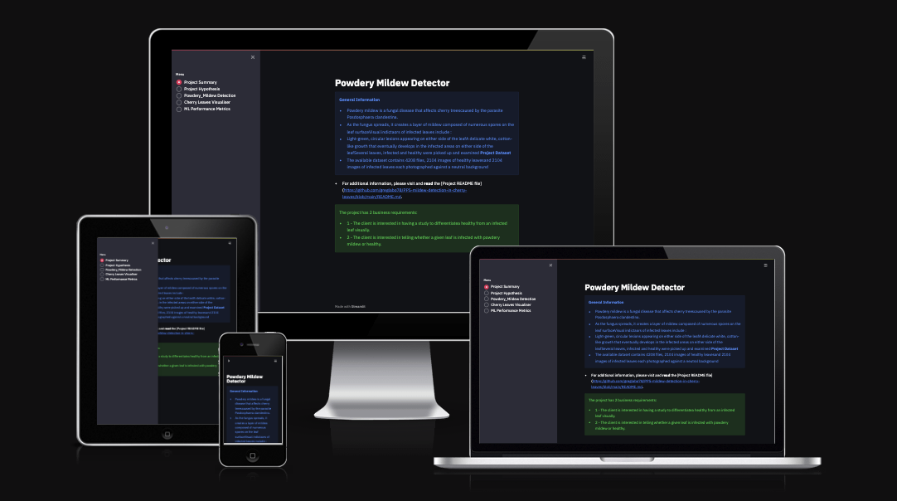
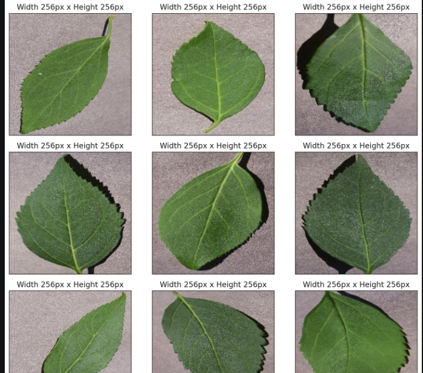
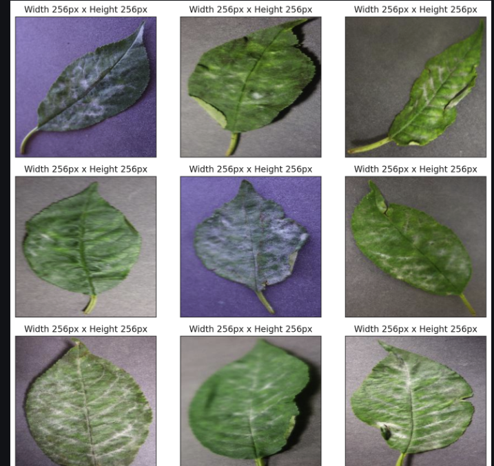
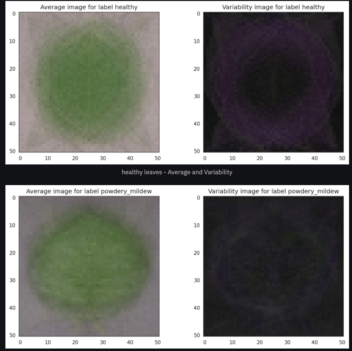
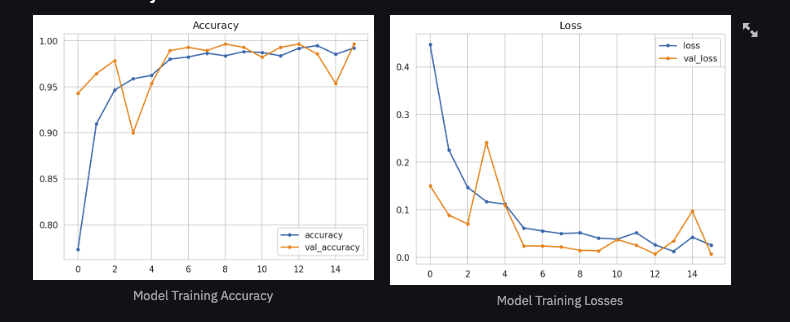

# 

# Mildew Dectection in Cherry Leaves



## Project Description

Marianne McGuineys, head of IT and Innovation at Farmy & Foods, is facing a challenge with their cherry plantations presenting powdery mildew, a fungal disease affecting a wide range of plants. Cherry plantation is one of the finest products in the company's portfolio, and they are concerned about supplying the market with a compromised quality product.

Currently, the process involves manually verifying if a cherry tree contains powdery mildew, where an employee spends around 30 minutes per tree taking leaf samples and visually inspecting them. If mildew is detected, a specific compound is applied to kill the fungus, which takes about 1 minute. Given the thousands of cherry trees across multiple farms, this manual process is not scalable due to the time required for inspection.

To save time, the IT team suggested developing a Machine Learning (ML) system capable of instantly detecting whether a cherry leaf is healthy or has powdery mildew using an image of the leaf. A similar process is in place for other crops for pest detection, and success in this initiative could lead to replicating the project for all other crops. The dataset comprises cherry leaf images provided by Farmy & Foods, taken from their crops.

This project aims to build a dashboard to detect whether a cherry leaf is healthy or has powdery mildew.

## Table of Contents
1. [Dataset Content](#dataset-content)
2. [Business Requirements](#business-requirements)
3. [Hypothesis and Validation](#hypothesis-and-validation)
4. [Rationale for the Model](#rationale-for-the-model)
5. [Rationale for Mapping Business Requirements to Data Visualizations and ML Tasks](#rationale-for-mapping-business-requirements-to-data-visualizations-and-ml-tasks)
6. [ML Business Case](#ml-business-case)
7. [Dashboard design](#dashboard-design)
8. [Unfixed Bugs](#unfixed-bugs)
9. [The methodology known as the Cross-Industry Standard Process for Data Mining (CRISP-DM)](#the-methodology-known-as-the-cross-industry-standard-process-for-data-mining-crisp-dm)
10. [Testing](#testing)
11. [Validation](#validation)
12. [Deployment](#deployment)
13. [Technology Used](#technologies-used)
14. [Main Data Analysis and Machine Learning Libraries](#main-data-analysis-and-machine-learning-libraries)
15. [Acknowledgements](#acknowledgements)
16. [Credits](#credits)


## Dataset Content

The dataset contains 4,208 images of cherry leaves, which are either healthy or infested with powdery mildew. These images were taken from the crops of Farmy & Foods. Each image has dimensions of 256x256 pixels. The dataset is labeled into two classes: healthy and powdery mildew.

You can access the dataset on [Kaggle](https://www.kaggle.com/datasets/codeinstitute/cherry-leaves).


## Business Requirements

Farmy & Foods, a company in the agricultural sector, has requested the development of a Machine Learning-based system to instantly detect powdery mildew in cherry trees. This system should use images of cherry leaves to determine whether they are healthy or require treatment. The current manual inspection process, which takes about 30 minutes per tree, is not scalable due to the large number of cherry trees spread across multiple farms. Automating this process with an ML system aims to save time and improve efficiency.

Summary:
1. Conduct a study to visually differentiate a healthy cherry leaf from one infected by powdery mildew.
2. Predict if a cherry tree is healthy or contains powdery mildew.
3. Obtain a prediction report of the examined leaves.

## Hypothesis and Validation

### Hypothesis 1
**Hypothesis:** Infected leaves have clear visual markers differentiating them from healthy leaves.
**Validation:** Conduct a visual study of average images and variability images for each class (healthy and powdery mildew). Create image montages to highlight these differences.

### Hypothesis 2
**Hypothesis:** A neural network with specific architectural choices (e.g., using softmax  in the output layer) will yield better classification performance.
**Validation:** Train models using softmax configurations and optimize performance metrics, such as accuracy and loss, using learning curves and validation results.

#### Hypothesis 1

**Hypothesis:** Infected leaves have distinct visual features that differentiate them from healthy leaves.

#### Introduction

Cherry leaves affected by powdery mildew typically exhibit specific symptoms: initially, light-green, circular lesions appear on either leaf surface, followed by a subtle white, cotton-like growth in the infected areas. These characteristics must be translated into machine learning terms, requiring images to be properly prepared for optimal feature extraction and model training.

#### Understanding the Problem and Mathematical Functions

When working with an image dataset, normalizing the images before training a neural network is crucial for two main reasons:

1. **Consistency:** It ensures that the neural network produces consistent results when tested with new images.
2. **Transfer Learning:** Normalization facilitates transfer learning by standardizing the input images.

To normalize an image, we need to compute the mean and standard deviation of the entire dataset. This process considers four dimensions of an image:

- **B:** Batch size (number of images)
- **C:** Number of channels in the image (3 for RGB images)
- **H:** Height of each image
- **W:** Width of each image

The mean and standard deviation are calculated separately for each channel. Since loading the entire dataset into memory at once is impractical, we can load small batches of images sequentially to compute these statistics, which can be a non-trivial task.

2. Observation
A visual montage highlights the clear distinctions between healthy leaves and those infected with mildew.




There is no visible difference betweeen avaerage and variabilty images to enable the identification of affected leaves.



3. Conclusion
The model successfully identified the differences, learning to distinguish and generalize for accurate predictions. A well-trained model predicts classes on a data batch without overfitting, enabling it to generalize and accurately forecast future observations by recognizing general patterns rather than memorizing specific relationships from the training dataset.

### Hypothesis 2

**Hypothesis:** Using Sigmoid activation function in the CNN output layer for this classification task.

#### Introduction

Understanding the Problem and Mathematical Functions
The model needs to classify cherry leaves as either healthy or infected, making this a classification problem. This can be approached as binary classification (healthy vs. infected).

For binary classification, a single output node is used, with probabilities ranging from 0 to 1. If the probability is less than 0.5, the leaf is classified as healthy (class 0); if it is 0.5 or greater, it is classified as infected (class 1). This is managed by the sigmoid function, which compresses outputs to the [0, 1] range. However, sigmoid functions can suffer from sharp damp gradients during backpropagation, affecting learning efficiency.

Backpropagation adjusts network weights by flowing error values back through the network, using the derivative of the sigmoid function to inform weight adjustments. However, very high or low error values result in low derivatives, causing a "squashing" effect.

For multiclass classification with two output nodes, the softmax function is used. This function also outputs values in the [0, 1] range but normalizes the outputs into a probability distribution that sums to 1. The class with the highest probability is chosen.

2. Obseervation
The model training output is depicted in two graphs: one for loss and one for accuracy, both showing training and validation metrics.



#### Loss Graph:
1. **Initial Decrease**: Both training and validation loss start high and decrease significantly in the first few epochs, indicating effective learning.
2. **Fluctuations**: Validation loss shows fluctuations, especially around epochs 3 and 13, suggesting potential overfitting.
3. **Convergence**: Training and validation losses converge towards lower values overall, indicating positive training progress.

#### Accuracy Graph:
1. **Initial Increase**: Both training and validation accuracies increase rapidly in the initial epochs, demonstrating quick learning.
2. **High Values**: Training and validation accuracies reach and stay above 0.95 for most of the training process, indicating good performance.
3. **Fluctuations**: Validation accuracy shows some fluctuations, similar to validation loss, indicating possible overfitting or variability in the validation set.

### Conclusion:
The model exhibits strong learning capabilities and high accuracy, but shows signs of overfitting. Adjusting regularization and validation strategies should help stabilize the validation metrics and improve overall performance.


#### Understanding How to Evaluate Performance

Learning curves plot model performance over time or experience, typically showing the model's progress on both training and validation datasets. They help diagnose issues like underfitting or overfitting. 

Key terms include:
- **Epoch:** One complete pass through the training data.
- **Loss:** Measures prediction errors. Lower loss indicates better performance.
- **Accuracy:** Fraction of correct predictions. Higher accuracy indicates better performance.

A good fit is shown by decreasing training and validation loss to a stable point with minimal gap. A small generalization gap between training and validation loss/accuracy indicates good performance. Overfitting occurs if training continues beyond this point, which is why early stopping is often used.


## Rationale for the Model

The model is designed to efficiently classify cherry leaves as healthy or infected with powdery mildew. Below are the architectural choices and their rationale:

The model has one input layer, three hidden layers (three convolutional layers, one fully connected layer), and one output layer.

#### Goal

Hyperparameters, the number of hidden layers, and the optimizer were chosen through trial and error. While this model might not be the ultimate best, it was selected based on the performance observed through multiple tests and adjustments. This model balances the ability to generalize and predict accurately without overfitting, as it learns the general patterns from the dataset rather than memorizing specific relationships.

#### Choosing the Hyperparameters

- **Convolutional Layer Size:** A 2D CNN (Conv2D) is suitable for our non-volumetric images. A 1D convolution layer is not appropriate here.
- **Convolutional Kernel Size:** The 3x3 convolutional filter moves across the image dimensions, capturing small details effectively. It is preferred over 2x2 and 5x5 for its balance in capturing fine details and computational efficiency.
- **Number of Neurons:** Powers of 2 are chosen for computational efficiency and optimization.
- **Activation Function:** ReLU is chosen for its simplicity, speed, and ability to avoid the vanishing gradient problem, helping the network converge quickly and reliably.
- **Pooling:** MaxPooling is used to reduce computational complexity and variance, selecting the most prominent features. It works well with our dataset where the background is dark and mildew is lighter.
- **Output Activation Function:** Sigmoid is used for binary classification.
- **Dropout:** A dropout rate of 50% prevents overfitting by nullifying some neurons during training, ensuring that the model generalizes well.

## Rationale for Mapping Business Requirements to Data Visualizations and ML Tasks

The primary business requirements were translated into user stories, which were then broken down into machine learning tasks. Each task was manually tested to ensure proper functionality.

### Business Requirement 1: Data Visualization

The client needs a study to visually distinguish between a healthy cherry leaf and one affected by powdery mildew.

#### User Stories:
- As a client, I want to navigate easily through an interactive dashboard to view and understand the presented data.
- As a client, I want to see the "mean" and "standard deviation" images for both healthy and powdery mildew-infected cherry leaves to visually differentiate them.
- As a client, I want to see the differences between an average healthy cherry leaf and an average infected leaf.
- As a client, I want to see an image montage for both healthy and infected cherry leaves for visual comparison.

These user stories are addressed by implementing the following tasks in the Streamlit dashboard and the data visualization notebook:
- A Streamlit-based dashboard with an easy-to-navigate sidebar.
- Visualization of differences between average healthy and infected leaves.
- Display of "mean" and "standard deviation" images for both classes.
- Creation of image montages for healthy and infected leaves.

### Business Requirement 2: Classification

The client wants to determine if a given cherry leaf is affected by powdery mildew.

#### User Story:
- As a client, I want a machine learning model to predict with at least 97% accuracy whether a cherry leaf is healthy or infected.

This user story is addressed by the following tasks presented in the Streamlit dashboard and data visualization notebook:
- Explanation of the rationale behind the deployed ML model.
- An uploader widget allowing the client to upload cherry leaf images for instant evaluation. Key features include:
  - Images must be in .jpeg format.
  - Multiple images can be uploaded at once
  - The dashboard displays the uploaded image and the prediction, indicating if the leaf is infected with powdery mildew and the associated probability.

### Business Requirement 3: Report

The client desires a prediction report of the examined leaves.

#### User Story:
- As a client, I want to obtain a report from the ML predictions on new leaves.

This user story is addressed by implementing the following task in the Streamlit dashboard:
- After each batch of images is uploaded, a downloadable .csv report with the predicted statuses is made available.


## ML Business Case

### Powdery Mildew Classificator

We aim to develop a machine learning model to determine whether a cherry leaf is infected with powdery mildew, using the image dataset provided by Farmy & Foods. This is a supervised learning problem, specifically a binary classification task.

#### Objective

The primary goal is to equip farmers with a fast and reliable tool for detecting powdery mildew, enhancing the current manual inspection process.

#### Success Metrics

- Achieve an accuracy of 97% or higher on the test set.

#### Model Output

The model will output a flag indicating the presence of powdery mildew on a leaf and the probability of infection. Farmers can upload images of leaves to the application for real-time predictions.

#### Current Method

Currently, farmers manually inspect each tree, spending about 30 minutes per tree to sample and visually check the leaves, which is time-consuming and prone to human error.

#### Training Data

The model will be trained on a dataset of 4,208 cherry leaf images, provided by Farmy & Foods and available on Kaggle.


## Dashboard Design

### Project Summary

**Powdery Mildew Detector**

Powdery mildew is a fungal disease that affects cherry trees, caused by the parasite *Posdosphaera clandestina*. As the fungus spreads, it creates a layer of mildew composed of numerous spores on the leaf surface. Visual indicators of infected leaves include:
- Light-green, circular lesions appearing on either side of the leaf
- A delicate white, cotton-like growth that eventually develops in the infected areas on either side of the leaf

Several leaves, both infected and healthy, were collected and examined.

**Project Dataset**

The available dataset contains 4,208 files:
- 2,104 images of healthy leaves
- 2,104 images of infected leaves

All images are photographed against a neutral background.

### Page 2: Project Hypothesis and Validation

This page provides detailed information on the project hypotheses, explanations, validations, and conclusions. See the **Hypothesis and Validation** section for more details.

### Page 3: Powdery Mildew Detector

This page addresses Business Requirements 2 and 3: Classification and Reporting. It includes:

- **Image Upload:** A file uploader widget for users to upload cherry leaf images (JPEG format, multiple images up to 200MB).
- **Instant Evaluation:** Display of the uploaded image along with a prediction statement indicating whether the leaf is infected, including the probability of infection.
- **Report Generation:** After batch uploads, a downloadable CSV report with prediction results for the examined leaves.

### Page 4: ML Performance Metrics

This page displays performance metrics of the machine learning model, including:

- Label frequencies for train, validation, and test sets.
- Model history (accuracy and loss plots).
- Model evaluation results on the test set.

## Unfixed Bugs

### Unfixed Bug: Model Overfitting and Hyperparameter Optimization

The model training output is depicted in two graphs: one for loss and one for accuracy, both showing training and validation metrics.

#### Loss Graph:
1. **Initial Decrease**: Both training and validation loss start high and decrease significantly in the first few epochs, indicating effective learning.
2. **Fluctuations**: Validation loss shows fluctuations, especially around epochs 3 and 13, suggesting potential overfitting.
3. **Convergence**: Training and validation losses converge towards lower values overall, indicating positive training progress.

#### Accuracy Graph:
1. **Initial Increase**: Both training and validation accuracies increase rapidly in the initial epochs, demonstrating quick learning.
2. **High Values**: Training and validation accuracies reach and stay above 0.95 for most of the training process, indicating good performance.
3. **Fluctuations**: Validation accuracy shows some fluctuations, similar to validation loss, indicating possible overfitting or variability in the validation set.

### Recommendations:
1. **Regularization**: Add techniques like dropout, L2 regularization, or data augmentation to address fluctuations and potential overfitting.
2. **Validation Strategy**: Ensure the validation set is representative of the overall dataset for stable validation metrics.
3. **Learning Rate**: Experiment with adjusting the learning rate or using a scheduler to reduce it over time if fluctuations are significant.
4. **Early Stopping**: Implement early stopping to prevent overfitting when validation loss stops improving.

### Conclusion:
The model exhibits strong learning capabilities and high accuracy, but shows signs of overfitting. Optimizing hyperparameters through adjustments in regularization, validation strategy, learning rate, and early stopping should help eliminate overfitting and improve overall performance.

## The methodology known as the Cross-Industry Standard Process for Data Mining (CRISP-DM)
CRISP-DM, short for Cross-Industry Standard Process for Data Mining, is a widely recognized framework for directing data mining projects.

This methodology outlines the common stages of a project, detailing the tasks associated with each stage and explaining the connections between these tasks.
As a process model, CRISP-DM offers a comprehensive view of the data mining life cycle.

The process is tracked using the Kanban Board available in the project section of this [GitHub repository](https://github.com/users/greglabo78/projects/8/views/1)

## Testing
### Manual Testing

### User Story Testing

#### Business Requirement 1: Data Visualization

#### Navigation

**As a client, I can navigate easily through an interactive dashboard so that I can view and understand the data.**

| Feature         | Action                                   | Expected Result                                    | Actual Result         |
|-----------------|------------------------------------------|---------------------------------------------------|-----------------------|
| Navigation bar  | Selecting buttons in the side menu       | Selected page displayed with correct information   | Functions as expected |

#### Leaves Visualizer Page

**As a client, I can view visual graphs of average images, image differences, and variabilities between healthy and infected cherry leaves, so that I can identify them more easily.**

| Feature                             | Action                              | Expected Result                                     | Actual Result         |
|-------------------------------------|-------------------------------------|----------------------------------------------------|-----------------------|
| Average and variability images checkbox | Ticking the checkbox                 | Relevant image plots are rendered                   | Functions as expected |
| Difference between average image checkbox | Ticking the checkbox                 | Relevant image plots are rendered                   | Functions as expected |
| Image montage checkbox              | Ticking the Image Montage checkbox  | Dropdown select menu appears for label selection along with the button "Create montage" | Functions as expected |
| Image montage creation button       | After selecting the label, pressing 'Create Montage' button | Relevant image montage of the correct label is displayed | Functions as expected |

#### Business Requirement 2: Classification

#### Powdery Mildew Detection Page

**As a client, I can upload image(s) of cherry leaves to the dashboard so that I can run the ML model and get an immediate, accurate prediction of powdery mildew.**

| Feature        | Action                                      | Expected Result                                         | Actual Result         |
|----------------|---------------------------------------------|--------------------------------------------------------|-----------------------|
| File uploader  | Uploading cleaned image data via Browse files button | The result is a displayed prediction of Healthy or Infected leaf with a graphical display of probabilities | Functions as expected |

**As a client, I can save model predictions in a timestamped CSV file so that I can have a documented history of the predictions made.**

| Feature             | Action                        | Expected Result                                                   | Actual Result         |
|---------------------|-------------------------------|------------------------------------------------------------------|-----------------------|
| Download Report link| Clicking on the download link | A CSV file with timestamps in the name and prediction details is saved on the client's machine | Functions as expected |

#### Business Requirement 3: Report

**As a client, I can obtain a report of the ML predictions on new leaves.**

| Feature             | Action                        | Expected Result                                                   | Actual Result         |
|---------------------|-------------------------------|------------------------------------------------------------------|-----------------------|
| Download Report link| Clicking on the download link | A CSV file with timestamps in the name and prediction details is saved on the client's machine | Functions as expected |


## Validation

#### Python Code Validation

The Python code was validated for PEP8 standards as follows:

#### Jupyter Notebooks

1. Installed the `pycodestyle` package:
    ```sh
    pip install pep8 pycodestyle pycodestyle_magic
    ```
2. Added the following cell at the top of the notebook:
    ```python
    %load_ext pycodestyle_magic
    %pycodestyle_on
    ```
3. Ran the cells in a copy of the notebooks and then edited the originals based on the errors indicated.

#### Streamlit App Pages and Source Code Files

For the Streamlit app pages and source code files, the [CI Python Linter](https://pep8ci.herokuapp.com/) was used for validation.


## Deployment

### Project Hosting

The project is developed and hosted on GitHub and deployed using Heroku.

### Creating the Heroku App

Follow these steps to deploy the project on Heroku:

1. Create a `requirements.txt` file in GitHub listing the necessary dependencies for the program.
2. Set the `runtime.txt` to specify the Python version compatible with Heroku-20 stack.
3. Push the latest changes to GitHub and navigate to your Heroku account to create and deploy the app.
4. Choose "CREATE NEW APP", provide a unique name, and select a geographical region.
5. Add `heroku/python` buildpack from the Settings tab.
6. Under the Deploy tab, choose GitHub as the deployment method, connect to GitHub, and select the project's repository.
7. Select the desired branch to deploy and click "Deploy Branch".
8. Enable Automatic Deploys or manually deploy the branch.
9. Wait for the logs to confirm that dependencies are installed and the app is built.
10. Access the app via a URL similar to `https://your-projects-name.herokuapp.com/`.
11. If the slug size is too large, use a `.slugignore` file to exclude unnecessary large files.

### Forking the Repository

Forking this GitHub repository creates a copy in your GitHub account. Steps to fork the repository:
1. Locate the GitHub repository of this project and log into your GitHub account.
2. Click the "Fork" button at the top right of the page, above "Settings".
3. Choose where to fork the repository (e.g., your account).
4. You now have a copy of the original repository in your GitHub account.

### Making a Local Clone

Cloning a repository downloads a complete copy of all repository data. Steps to clone a repository:
1. Locate the GitHub repository of this project and log into your GitHub account.
2. Click the "Code" button at the top right of the page.
3. Choose an option: Clone with HTTPS, Open with GitHub Desktop, or Download ZIP.
4. To clone using HTTPS, copy the link under "Clone with HTTPS".
5. Open Git Bash and navigate to your desired location.
6. Type:
    ```sh
    $ git clone https://github.com/your-username/mildew-detection-in-cherry-leaves.git
    ```
7. Press Enter and wait for the repository to be cloned.

For more detailed instructions, refer to the GitHub documentation.

You can find the live link to the site here: [Powdery Mildew Detector](https://your-projects-name.herokuapp.com/)


### Heroku

- The App live link is: `https://YOUR_APP_NAME.herokuapp.com/`
- Set the runtime.txt Python version to a [Heroku-20](https://devcenter.heroku.com/articles/python-support#supported-runtimes) stack currently supported version.
- The project was deployed to Heroku using the following steps.

1. Log in to Heroku and create an App
2. At the Deploy tab, select GitHub as the deployment method.
3. Select your repository name and click Search. Once it is found, click Connect.
4. Select the branch you want to deploy, then click Deploy Branch.
5. The deployment process should happen smoothly if all deployment files are fully functional. Click the button Open App on the top of the page to access your App.
6. If the slug size is too large, then add large files not required for the app to the .slugignore file.

## Technologies Used

### Platforms
- **Heroku:** Used to deploy this project.
- **Jupyter Notebook:** Utilized for coding and editing the project.
- **Kaggle:** Source for downloading datasets for this project.
- **GitHub:** Repository for storing project code after being pushed from Gitpod.
- **Gitpod:** IDE used for writing code, with its terminal used to commit to GitHub and push to GitHub Pages.

### Languages
- **Python**
- **Markdown**


## Main Data Analysis and Machine Learning Libraries

- tensorflow-cpu 2.6.0  used for creating the model
- numpy 1.19.2          used for converting to array 
- scikit-learn 0.24.2   used for evaluating the model
- streamlit 0.85.0      used for creating the dashboard
- pandas 1.1.2          used for creating/saving as dataframe
- matplotlib 3.3.1      used for plotting the sets' distribution
- keras 2.6.0           used for setting model's hyperparamters
- plotly 5.12.0         used for plotting the model's learning curve 
- seaborn 0.11.0        used for plotting the model


## Credits

### Content Sources
- The leaves dataset was sourced from Kaggle and created by Code Institute.
- The description of powdery mildew was referenced from Garden Design and Almanac.
- The CRISP-DM steps utilized in this GitHub project were modeled after IBM's Introduction to CRISP-DM articles.

### Code and Templates
- The project template was provided by Code Institute on GitHub and their website.
- Streamlit dashboard pages, data collection, and data visualization Jupyter notebooks were inspired by Code Institute's Walkthrough Project 01 and served as a guiding example for this project.
- cla-cif /cherry-powdery-Mildew detector was used as a north star and source of inspiration in the development of this project.


## Acknowledgements
I would like to express my sincere gratitude to my mentor, Mo'Shami, for his invaluable support and guidance throughout this project. Additionally, I extend my thanks to Code Institute for their continuous support during my journey, which has culminated in this final milestone. Thanks to Tomislav an alumnus of code institue whose guidance in times of difficulty is priceless , thank you for your guidance and contionous motivation to enable me see this through to the end.


